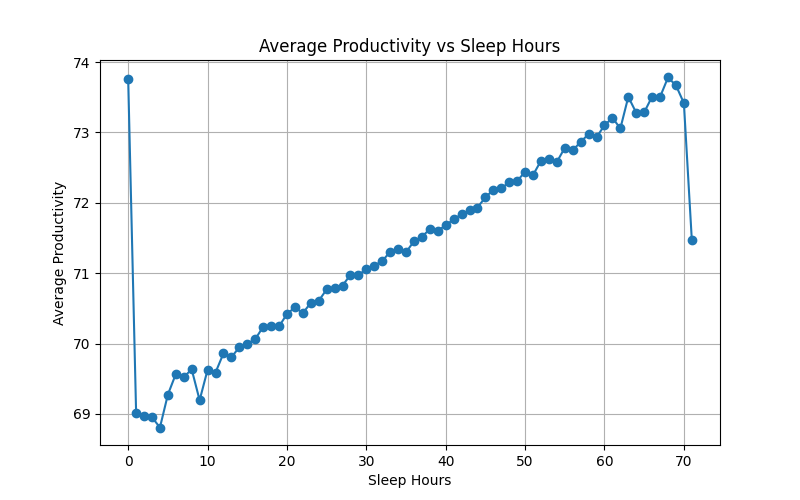
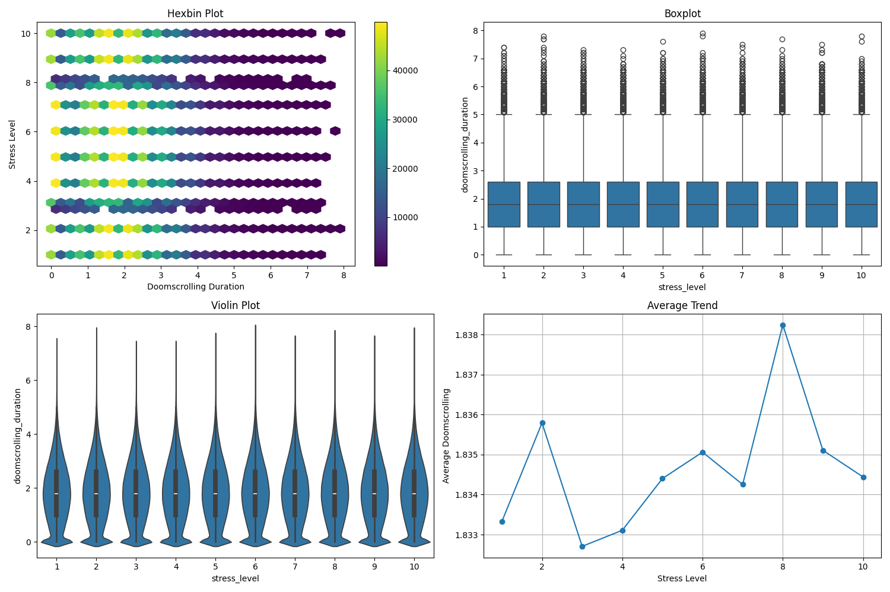
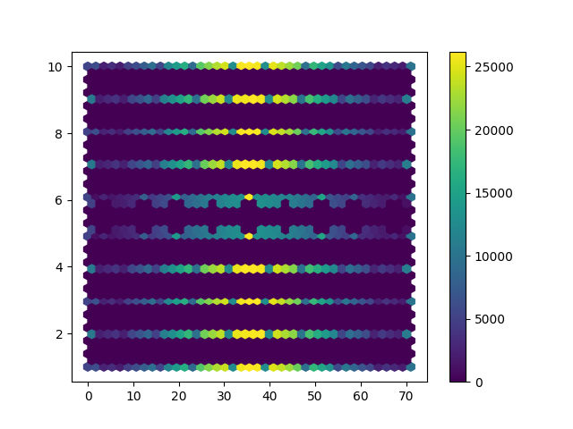
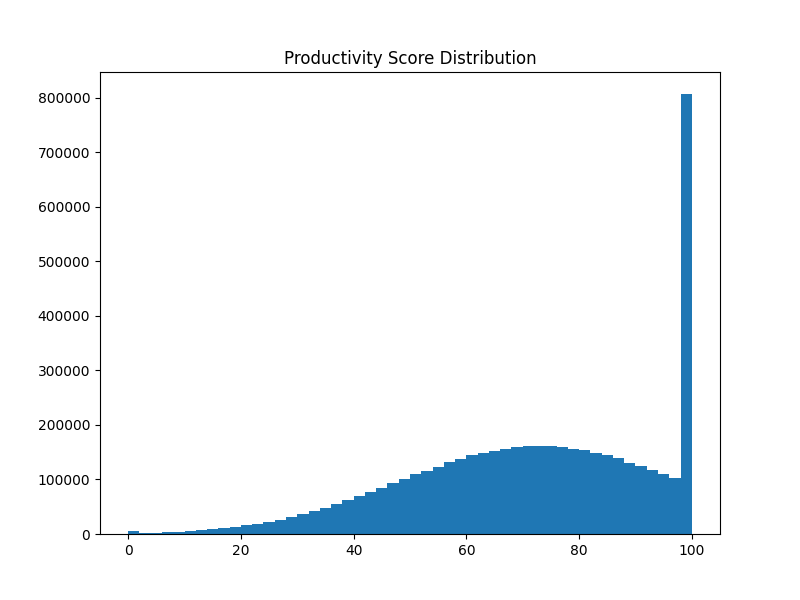
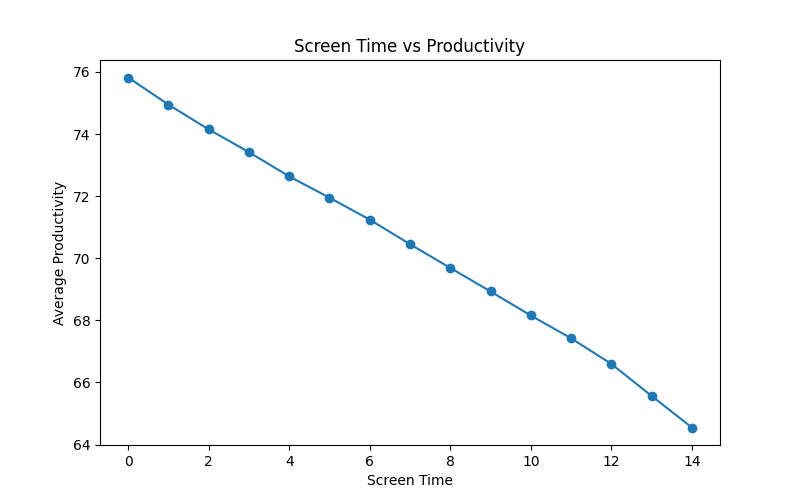
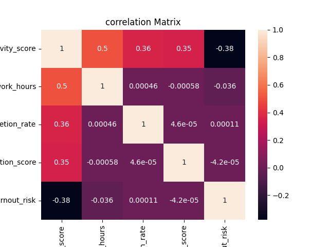

# Task 7 — Insights Report

## Overview

The dataset has 5 lakh records about how people behave online, how productive they are, how focused they are, how stressed they are, and how they work. We looked at the data in different ways and tried to find patterns and connections between these things.

---

# Observations

## 1. Sleep and Productivity

When we looked at how many hours people sleep and how productive they are, we found that sleep and productivity are connected in a positive way.

### Some important things we found:

- People who sleep more tend to be more productive.
- If people do not sleep much, they are not as productive.
- When people sleep well, they can work better and focus more.

This means that sleeping well is important for working efficiently and staying focused.

---

## 2. Doomscrolling and Stress

When we looked at how much time people spend doomscrolling and how stressed they are, we found a clear connection.

### Some important things we found:

- The more people doomscroll, the more stressed they are.
- People who spend a lot of time looking at their screens get more stressed.
- This trend remained visible even when analyzing a large amount of data.

This means that spending too much time online can negatively affect mental health.

---

## 3. Deep Work and Productivity

When we looked at how much time people spend working deeply and how productive they are, we found a strong connection.

### Some important things we found:

- People who work deeply are more productive.
- When people focus on their work, they can complete tasks better and stay focused.
- Deep work is one of the important factors for productivity.

---

## 4. Productivity Score Distribution

When we looked at how productivity scores are distributed, we found that most people have high productivity scores.

### Some important things we found:

- A large number of people have productivity scores close to the maximum value.
- The productivity distribution is not perfectly normal.
- The data may have been normalized or processed in some way.

This means that the productivity scoring system may have some limits or predefined rules.

---

## 5. Screen Time and Productivity

When we looked at screen time and productivity, we found that too much screen time can reduce productivity.

### Some important things we found:

- Moderate screen usage keeps productivity relatively stable.
- Very high screen time reduces productivity.
- Excessive screen time can distract people and increase mental fatigue.

---

# Correlation Analysis

When we looked at the relationships between different variables, we found some important connections.

## Positive Correlations

- Deep work hours and productivity score
- Task completion rate and productivity score
- Concentration score and productivity score

## Negative Correlations

- Burnout risk and productivity score
- Stress-related features and productivity metrics

These findings suggest that focus and deep work improve productivity, while stress and burnout reduce performance.

---

# Possible Issues in the Dataset

## 1. Highly Concentrated Productivity Scores

The productivity scores are heavily concentrated near higher values, which might indicate:

- The data has been normalized
- The values are capped
- The dataset may contain synthetic patterns

---

## 2. Discrete Feature Values

Some variables such as:

- Stress level
- Concentration score
- Burnout risk

use discrete scales instead of continuous values, which may reduce variability during analysis.

---

## 3. Potential Synthetic Patterns

Some patterns in the dataset appear overly smooth or perfect, which may indicate that parts of the dataset are artificially generated or heavily processed.

---

## 4. Dataset Size

The dataset contains approximately 5 lakh rows, which creates some visualization challenges:

- Normal scatter plots become inefficient
- Overplotting occurs frequently
- Aggregated visualizations are more effective for analysis

---

# Key Conclusions

- Sleep helps people become more productive and focused.
- Doomscrolling increases stress levels.
- Deep work improves productivity.
- Burnout and stress negatively affect productivity.
- Excessive screen time can harm productivity and mental health.
- Aggregated analysis techniques are more suitable for very large datasets.

Overall, the dataset shows that online behavior, mental health, focus, and productivity are strongly connected.